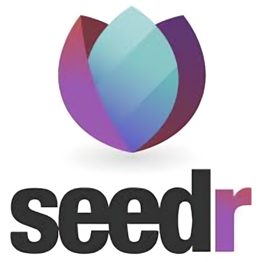

# Seedr for Kodi

Stream content from your Seedr.cc cloud storage directly to Kodi.

## About

This Kodi addon allows you to access and stream your Seedr.cc cloud storage content directly through the Kodi media center. Stream videos, play audio playlists, view images, and more.

## Installation

**Quick Installation:**

1. Download and install [repository.seedr-1.0.1.zip](https://jose987654.github.io/kodi-addons/repository.seedr-1.0.1.zip)
2. Install the Seedr addon from the repository

Detailed installation instructions available on the [project homepage](https://jose987654.github.io/kodi-addons/).

## Key Features

- Stream videos directly from your Seedr.cc account
- Play audio files with playlist support
- View images and PDF files
- Automatic subtitle detection
- Simple authentication
- Intuitive navigation

## Repository Structure

- `/plugin.video.seedr` - Source code for the Seedr addon
- `/repository.seedr` - Repository addon files
- `/update_repo.py` - Script for updating repository files

## Contributing

Contributions are welcome! If you'd like to help improve the addon, please fork the repository and submit a pull request.

## License

This project is licensed under the [GPL-3.0 License](../LICENSE).
